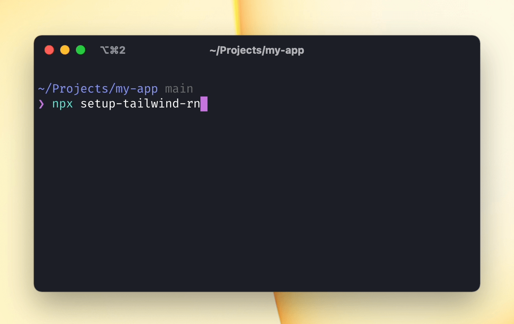

# setup-tailwind-rn [](https://github.com/vadimdemedes/setup-tailwind-rn/actions/workflows/test.yml)

> Add [tailwind-rn](https://github.com/vadimdemedes/tailwind-rn) to your React Native project automatically



## Usage

Run the following in the root of your React Native project:

```
$ npx setup-tailwind-rn
```

## Related

- [tailwind-rn](https://github.com/vadimdemedes/tailwind-rn) - Use Tailwind in React Native apps
